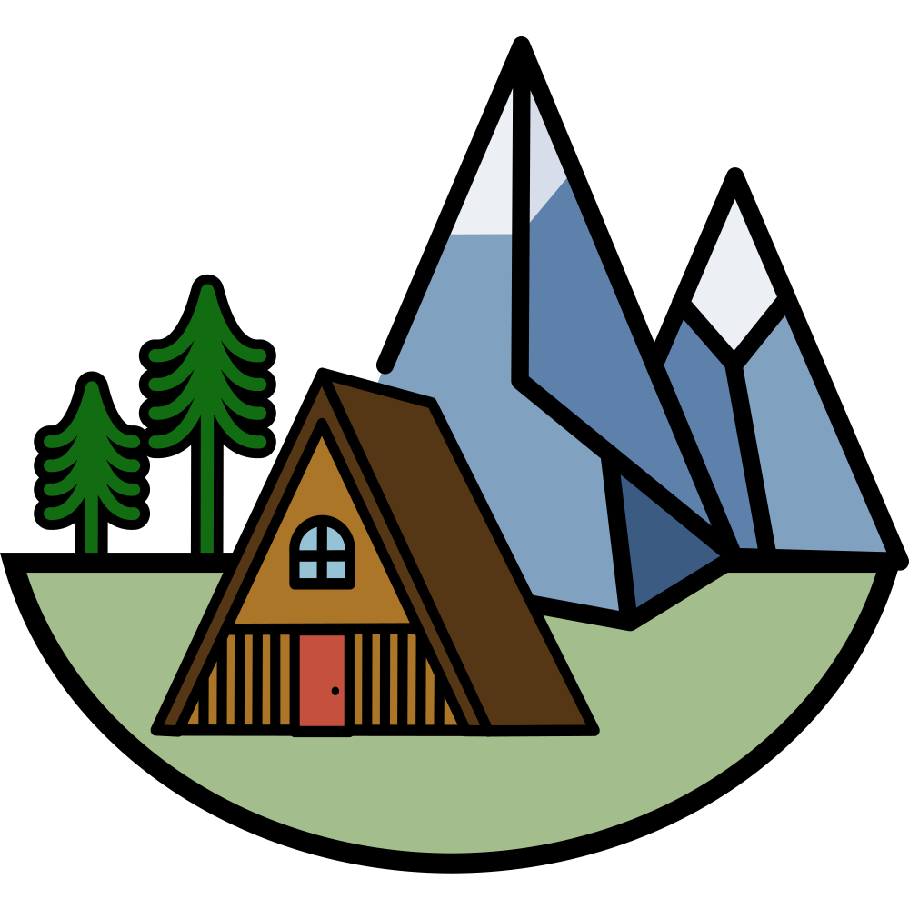
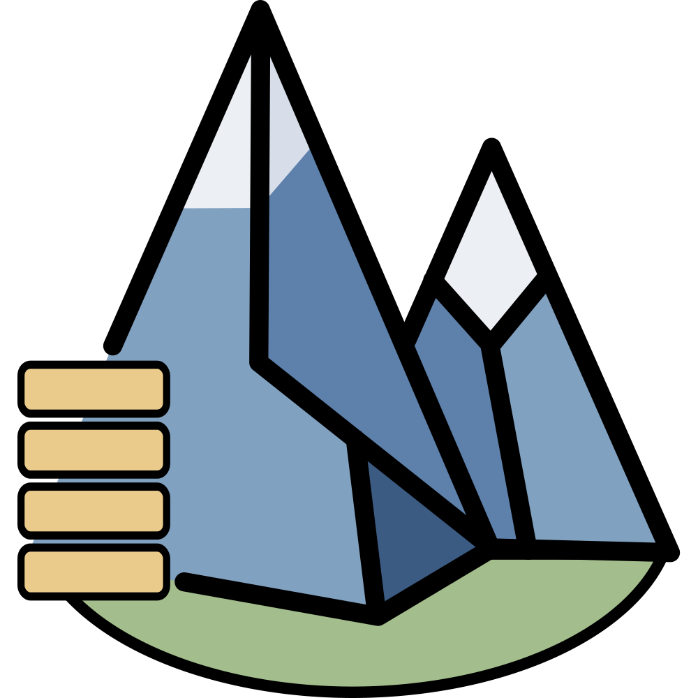
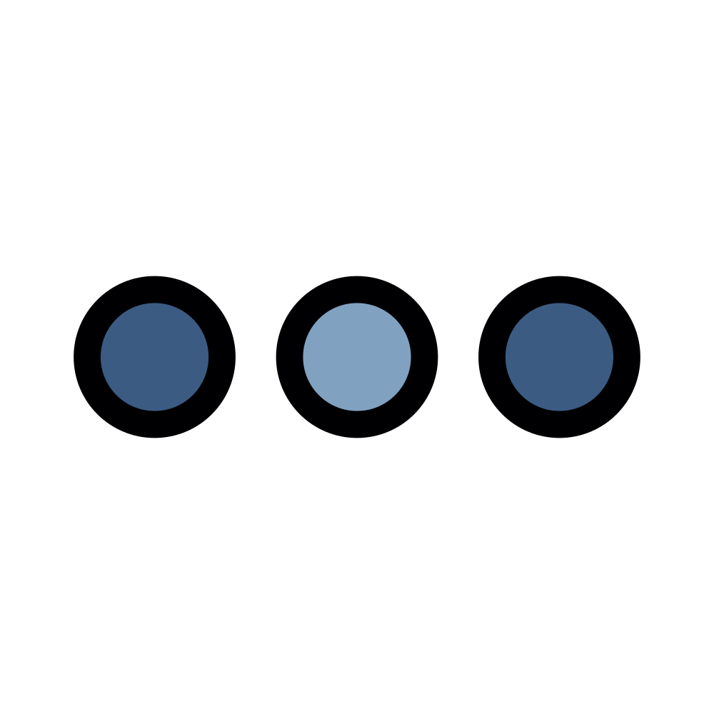
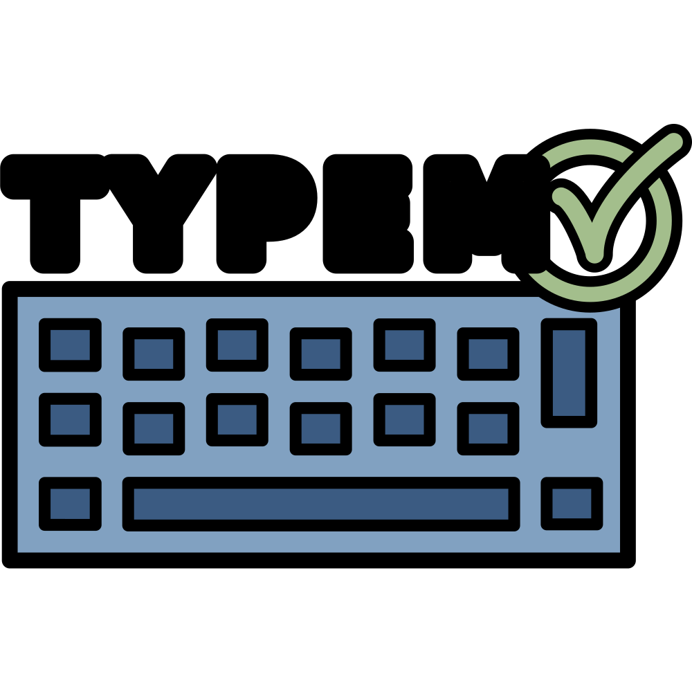

<h1 align="center">
  <a href="https://assets.fjelloverflow.dev">assets</a>
</h1>

  Static assets, hosted at <a href="https://assets.fjelloverflow.dev" target="_blank" >assets.fjelloverflow.dev</a>

    
    
    
    
    
    
    
    

